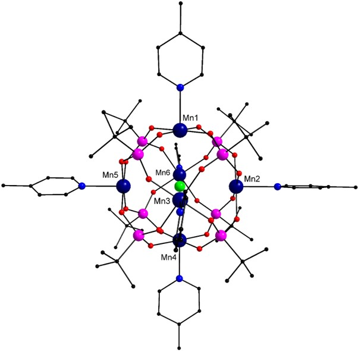

<html><head></head><body>
<h1>Example Input Files</h1>

<h2>Example 1</h2>

To understand the construction of the input files, let us take the example of a dimeric Mn complex shown in Figure 1 below.
Here the Mn centres are in +IV oxidation state (d3 spin configuration).
[<a href="refs.htm#Libby" class="showTip Libby">Libby</a>]

 <b><i>Structure of the {MnIV2} complex. Colour scheme: Mn (dark blue), C (black), 
N (blue) and O (red). Hydrogen atoms have been removed for clarity.</i></b>
 

The Mn centres in this complex interact with each other via the oxo groups and the Hamiltonian for this complex can be written as follows:

 &nbsp;&nbsp;&nbsp;&nbsp;H&#770 = -2J&lt;s1.s2&gt; 

This Hamiltonian can be represented using the following input file: 

<pre>
magnetic centres
2
J values
1
Hamiltonian
1 2
Hamiltonian Ends

</pre>

 The spin operators were obtained using Bader population analysis and the energy was obtained from DFT calculations. The DFT calculations were 
performed using the PBE0 functional in conjunction with the SDDALL basis set having an effective core potential for the Mn atoms and 6-31g (d,p) 
basis set for C, O, N and H atoms. The first two numbers on each line represent the spin density on each of the two Mn centre in a given spin 
configuration and the last number on the line represents the energy of the corresponding state in Hartrees. The following is an example spin operator 
file for the same {Mn2} system.

<pre>
2.8580703 -2.8580187 -2.102258638432228E+03
2.9222485 2.9222495 -2.102255438348413E+03
</pre>

As the Mn centres are in +IV oxidation state, formally speaking, they should have three electrons in the d-orbitals. 
This is reflected in the spin density values which are close to 3. Although, Bader spin analysis was used here to determine the spin values,
it is possible to employ a different analysis scheme as well (e.g. Mulliken or Hirshfeld).

The energies given here are in scientific notation but they can be in non-scientific notation too.

These example input files and the resultant output file have also been provided as separate files in the package in the 'examples'directory.

 

<h2>Example 2</h2>
This examples corresponds to a {Mn3} complex shown in Figure 2.
[<a href="refs.htm#Li" class="showTip Li">Li</a>]  

 <b><i>Structure of the {MnIII3} complex. Colour scheme: Mn (dark blue), C (black), 
N (blue) and O (red). Hydrogen atoms have been removed for clarity.</i></b>
 

The structure of this molecule suggests that the interaction between each pair of Mn centres would be similar and hence, the Hamiltonian for this system can
be written as follows:

 &nbsp;&nbsp;&nbsp;&nbsp;H&#770 = -2J[&lt;s1.s2&gt; + 
&lt;s1.s3&gt; + &lt;s2.s3&gt;] 

This Hamiltonian can be represented using the following input file: 

<pre>
magnetic centres
3
J values
1
Hamiltonian
1 2
1 3
2 3
Hamiltonian Ends
</pre>
 

The spin operators for this complex were obtained using Bader population analysis and the energy was obtained from DFT calculations 
in a similar manner as for the {Mn2) complex described in example 1. The input file for the spins is given below: 

<pre>
-3.8272159 3.8433176 3.8435824 -2.973075127863509E+03
3.8610277 3.8601792 3.8611721 -2.973073907698517E+03
</pre>

 The first three numbers on each line represent the spin density on each of the three Mn centre in a given spin configuration and the last 
number on the line represents the energy of the corresponding state in Hartrees. As the Mn centres are in +III oxidation state, they should have three unpaired electrons  
which is reflected in the spin density values which are close to 3. 

These example input files and the resultant output file have also been provided as separate files in the package in the 'examples'directory.

 
<h2>Example 3, 4 and 5</h2>

These examples illustrate the use of ej_calc for the calculation of coupling constants in high-nuclearity complexes 
using different oxidation states of a {MnIII6} coordination complex (Figure 3) as a model.
[<a href="refs.htm#Tandon" class="showTip Tandon">Tandon</a>]  

 <b><i>Structure of the {Mn6} complex. Colour scheme: Mn (dark blue), P (pink), Cl (green), C (black), 
N (blue) and O (red). Hydrogen atoms have been removed for clarity.</i></b>

 

The Mn centres in this complex interact with each other via the phosphonate ligands and the central Cl- ion. 
Each Mn centre in this complex has 1 trans- and 4 cis- neighbours and one requires 2 J-values to account for these cis- and trans- interactions 
between Mn centres.[<a href="refs.htm#Tandon" class="showTip Tandon">Tandon</a>]  
 

In example 3, four of the Mn centres, Mn1, Mn2, Mn4 and Mn5, are in +IV oxidation state (d3 spin configuration) while the others are in +III oxidation state. 
This decreases the overall symmetry of the complex. Therefore, the Hamiltonian for this complex can be written as follows:

 &nbsp;&nbsp;&nbsp;&nbsp;H&#770 = -2J1[&lt;s1.s2&gt;]
-2J2[&lt;s1.s6&gt;] -2J3 [&lt;s2.s6&gt;]	
-2J4[&lt;s3.s6&gt;] -2J5[&lt;s4.s5&gt;] -2J6[&lt;s1.s3&gt; + 
&lt;s2.s3&gt;] -2J7[&lt;s1.s4&gt; + 	&lt;s2.s5&gt;]
-2J8[&lt;s1.s5&gt; + &lt;s2.s4&gt;] -2J9[&lt;s3.s4&gt;
 + &lt;s3.s5&gt;] -2J10[&lt;s4.s6&gt; + &lt;s5.s6&gt;] 

 

This Hamiltonian can be represented using the following input file: 

<pre>
magnetic centres
6
J values
10
Hamiltonian
1 2
****
1 6
****
2 6
****
3 6
****
4 5
****
1 3
2 3
****
1 4
2 5
****
1 5
2 4
****
3 4
3 5
****
4 6
5 6
Hamiltonian Ends

</pre>
 

The spin for this complex contains the spin denisty values and energies for this complex in 16 different states:

<pre>
3.0571596 -3.0639469 -3.7464936 2.9855949 -2.9932085 3.7482157 -8.604041138405300E+03
3.0630259 3.0695029 3.7482020 2.9895879 2.9967993 3.7496550 -8.604040107737754E+03
3.0598187 -3.0625074 3.7479051 2.9894173 2.9952609 3.7490933 -8.604040680248647E+03
3.0619779 3.0682985 -3.7456508 2.9868525 2.9946327 3.7487343 -8.604040566607677E+03
-3.0584743 -3.0654666 3.7469864 2.9876366 2.9949252 3.7488185 -8.604040902043736E+03
3.0589748 -3.0636630 -3.7461917 2.9864062 2.9934310 3.7484142 -8.604040874943079E+03
3.0586563 -3.0627242 3.7475793 2.9888559 -2.9897365 3.7489216 -8.604041108898091E+03
3.0608172 3.0671848 -3.7463169 2.9845575 2.9917289 -3.7479541 -8.604040943152329E+03
-3.0597455 -3.0663612 -3.7469399 2.9851125 2.9926246 3.7481106 -8.604040854591891E+03
-3.0600393 -3.0659642 3.7469386 2.9873684 -2.9907475 3.7484449 -8.604041044599930E+03
3.0572042 -3.0640366 -3.7464007 2.9855883 -2.9930794 3.7481997 -8.604041137238783E+03
3.0622106 3.0684403 3.7478383 -2.9811889 2.9966250 3.7491837 -8.604040552284641E+03
3.0595895 -3.0636304 3.7475299 -2.9825245 2.9951876 3.7486818 -8.604040820396753E+03
3.0588778 -3.0640557 3.7470154 2.9869496 2.9926678 -3.7477576 -8.604040921887142E+03
-3.0596644 -3.0668741 3.7464812 2.9853693 2.9919554 -3.7480008 -8.604040857690830E+03
3.0572908 -3.0642910 3.7466734 2.9859264 -2.9933809 -3.7481567 -8.604041205874382E+03
</pre>
 

These files along with the resultant output files are provided in the package. 

In example 4, the Mn centres Mn1, Mn2 and Mn4 are in +IV oxidation state while the others are in +III oxidation state. The overall symmetry 
of the complex is significantly reduced and capturing the full electronic picture requires the use of the following Hamiltonian:

 &nbsp;&nbsp;&nbsp;&nbsp;H&#770 = -2J1[&lt;s1.s2&gt;]
-2J2[&lt;s1.s3&gt;] -2J3[&lt;s1.s4&gt;] -2J4 [&lt;s1.s5&gt;]
-2J5 [&lt;s1.s6&gt;] -2J6 [&lt;s2.s3&gt;] -2J7 [&lt;s2.s4&gt;]
-2J8 [&lt;s2.s5&gt;] -2J9 [&lt;s2.s6&gt;] -2J10 [&lt;s3.s4&gt;]
-2J11[&lt;s3.s5&gt;] -2J12 [&lt;s3.s6&gt;] -2J13 [&lt;s4.s5&gt;] 
-2J14 [&lt;s4.s6&gt;] -2J15 [&lt;s5.s6&gt;]

 

	

 In example 5, all the Mn centres are in +III oxidation state. Only 2 J-values are required to account the exchange interactions between Mn centres
and the Hamiltonian for this complex can thus be written as follows:

 &nbsp;&nbsp;&nbsp;&nbsp;H&#770 = -2J1 [&lt;s1.s2&gt; + 	
&lt;s1.s3&gt; + &lt;s1.s5&gt; + &lt;s1.s6&gt; + &lt;s2.s3&gt; + 
&lt;s2.s4&gt; + &lt;s2.s6&gt; + &lt;s3.s4&gt; + &lt;s3.s5&gt;
 + &lt;s4.s5&gt; + &lt;s4.s6&gt; + &lt;s5.s6&gt;] -2J2 [&lt;s1.s4&gt; + 	
&lt;s2.s5&gt; + &lt;s3.s6&gt;]

 

The input files containing the Hamiltonian and the spin density data and the resultant output files for examples 4 and 5 are provided in the package.

    
</body></html>
