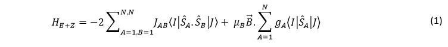

<html><head></head><body>
<h1>Introduction</h1>

Briefly, this code calculates the temperature dependence of magnetic susceptibility for a given system for which the exchange coupling constants have been determined. 
The following Hamiltonian is used to fulfil this purpose:[<a href="refs#Boca" class="showTip Boca">Boca</a>]  
 
 

 

where <i>JAB</i> is the coupling constant between the magnetic centres A and B, <i>I</i> and <i>J</i> represent the particular Ms terms in the basis elements that the 
<i>S&#770A.S&#770B</i> term operates on <i>B&#8407</i> represents the applied magnetic field, gA is the gyromagnetic tensor and μB is the unit 
Bohr Magneton. The first term accounts for the exchange coupling between Mn centres and the second term is the Zeeman term.

 The basic working of this code involves setting up a matrix of all possible MS (the magnetic spin quantum number) states for the given system. 
This is followed by operating each term of this matrix with eq. 1. Once this operation is complete, the matrix is diagonalised to obtain the eigenvalues which 
are then used to determine the magnetic susceptibility at different temperatures using the van Vleck equation. The details of the implementation of this 
procedure are later. 

<table border="0" cellpadding="2">
<tr valign="top"><td>
Jij
</td><td>&nbsp;&nbsp;</td>
<td>
The exchange coupling constant
</td></tr>
<tr valign="top"><td>
sx
</td><td>&nbsp;&nbsp;</td>
<td>
The spin operator.
</td></tr>
</table>

 Any definition of spin operators (formal spins or spin projections or spin densities or any other) can be used. Sometimes researchers exclude the pre-factor 
2 in the above formula so this needs to be kept in mind while using this code.

    
</body></html>
