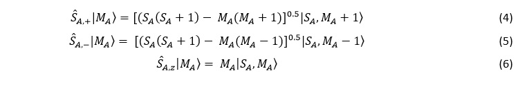
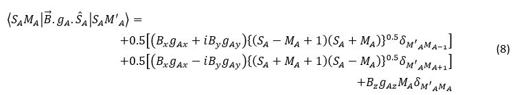
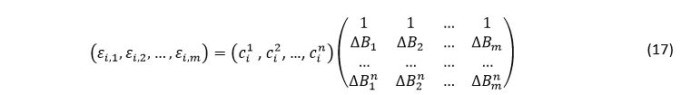
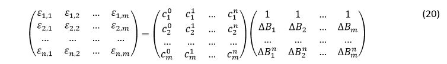
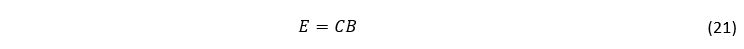

<html><head></head><body>
<h1>Theory</h1>

<b>Matrix Elements:</b> The matrix elements are constructed using an uncoupled basis comprising of spin elements (the magnetic spin quantum number, Ms, value) 
for each magnetic centre. If a magnetic centre has N unpaired electron, then the magnetic spin quantum number values for that particular magnetic centre range from N/2 
to –N/2; the consecutive values differing from each other by unity (total (N+1) values).

<b>Hamiltonian:</b> Only the two major contributors – the isotropic exchange term and the Zeeman term – to the Hamiltonian have been taken into consideration.

Isotropic Exchange term:[<a href="refs#Boca1" class="showTip Boca1">Boca1</a>]  

 

where <i>JAB</i> is the coupling constant between the magnetic centres A and B, <i>I</i> and <i>J</i> represent the particular Ms terms in the basis elements 
that <i>S&#770A.S&#770B</i> operate on and

 

where <i>S&#770A,+</i> and <i>S&#770B,-</i> are increment and decrement operators that are defined as follows: 

 

 

Zeeman term:[<a href="refs#Boca1" class="showTip Boca1">Boca1</a>] 

 

Here <i>B&#8407</i> represents the applied magnetic field, gA is the gyromagnetic tensor and μB is the unit Bohr Magneton.

 

where δAB is the kroenecker delta operator which is equal to 1 if A=B. Otherwise its value is 0. <i>Bi</i> and gAi represent the value of 
the magnetic field and the gyromagnetic tensor along a given direction. The effective Hamiltonian is thus given as 

 

The Hamiltonian matrix can thus be represented as 

 

where <i>AI</i> and <i>AJ</i> represent the elements of the basis and N is the total number of elements in the basis. 

The eigenvalues εi  and hence the energy levels of the various magnetic states are obtained by the diagonalisation of the Hamiltonian matrix. 
Once the eigenvalues are obtained, it can be used to plot the magnetic susceptibility with respect to temperature. To calculate the magnetic susceptibility, 
the Van Vleck equation is used which is:[<a href="refs#Kahn" class="showTip Kahn">Kahn</a>] 

 

where <i>ϵi(1)</i> and <i>ϵi(2)</i> are the first and second derivative of energy with respect to the magnetic induction, μ0 
is the permeability of free space, NA is the Avogadro’s number, <i>k</i> is the Boltzmann constant and <i>T</i> is the temperature. 

By Taylor expansion, the eigenvalues can be represented as:[<a href="refs#Boca" class="showTip Boca">Boca</a>] 

 

with

 

being the coefficients to be determined. To obtain these coefficients, 5 sets of eigenvalues, <i>εi,m</i> are generated using 5 different magnetic fields <i>Bm</i>
, where

 

where N = 0 and 1, and δ has been chosen to be equal B0/10.  Therefore,

 

for

 

In matrix form,

 

or

 

The matrix of coefficients can be calculated, provided the inverse of B exists, as follows:

 

By assembling the rows together, we obtain,

 

i.e., 

 

Thus all the coefficients can be determined by the following equation:

 

These coefficients can then be used to calculate the magnetic susceptibility using the Van Vleck equation which can now be given as:

 

</body></html>
