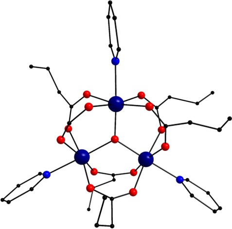
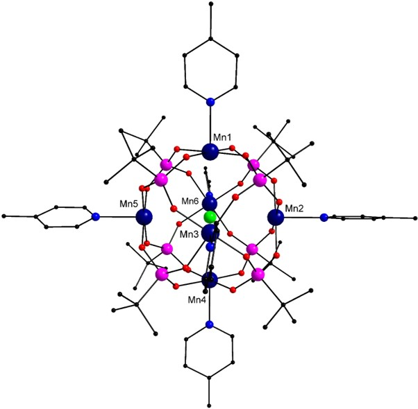

<html><head></head><body>
<h1>Example Input Files</h1>

<h2>Example 1</h2>

To understand the construction of the input files, let us take the example of a dimeric Mn complex shown in Figure 1 below.
Here the Mn centres are in +IV oxidation state (d3 spin configuration).
[<a href="refs.htm#Libby" class="showTip Libby">Libby</a>]

 <b><i>Structure of the {MnIV2} complex. Colour scheme: Mn (dark blue), C (black), 
N (blue) and O (red). Hydrogen atoms have been removed for clarity.</i></b>
 

The Mn centres in this complex interact with each other via the oxo groups and the Hamiltonian for this complex can be written as follows:

 &nbsp;&nbsp;&nbsp;&nbsp;H&#770 = -2J&lt;s1.s2&gt; 

The input file using the Hamiltonian mentioned above can be prepared as described below. The following additional parameters are used to complete the file
 – J1: -84.07 cm-1, g-value: 2.02, field strength: 1000 oersted. 

 
 <pre>
magnetic centres
2
spin
1.5
1.5
No. of J values
1
J values
-84.07
g value
2.02
Hamiltonian
1 2
Field Strength
1000.0
 </pre>
 

Here the number 2 in the second line specifies that there are 2 magnetic centres. This is followed by the specification of 
the spin on each centre. In this example, each centre has 3 unpaired electrons (Mn(IV) centres) and hence a spin value of 1.5. It is necessary to 
specify this value up to the first decimal place even if the spin value is a whole number. After specifying the spin on each centre, 
the details about the Hamiltonian are provided. In this example, 1 J-value is required and the magnitude of the J-value (-84.07 cm-1) 
is described following the number of J-values. This is followed by the specification of the g-value 
and the Hamiltonian which is then followed by the magnitude of the field strength in Oersted units (1000.0 in this case).

This example input file and the resultant output file have also been provided as separate files in the package. 

<h2>Example 2</h2>
This examples corresponds to a {Mn3} complex shown in Figure 2.
[<a href="refs.htm#Li" class="showTip Li">Li</a>]  

 <b><i>Structure of the {MnIII3} complex. Colour scheme: 
Mn (dark blue), C (black), N (blue) and O (red). Hydrogen atoms have been removed for clarity.</i></b>
 

The structure of this molecule suggests that the interaction between each pair of Mn centres would be similar and hence, the Hamiltonian 
for this system can be written as follows:

 &nbsp;&nbsp;&nbsp;&nbsp;H&#770 = -2J[&lt;s1.s2&gt; + 
&lt;s1.s3&gt; + &lt;s2.s3&gt;] 

The input file using the Hamiltonian mentioned above can be prepared as described below. The following additional parameters are used to complete the file
 – J1: -9.02 cm-1, g-value: 1.996, field strength: 1000 oersted. 

<pre>
magnetic centres
3
spin
2.0
2.0
2.0
No. of J values
1
J values
-9.02
g value
1.996
Hamiltonian
1 2
1 3
2 3
Field Strength
1000.0
</pre>

Here the number 3 in the second line specifies that there are 3 magnetic centres. This is followed by the specification of 
the spin on each centre. In this example, each centre has 4 unpaired electrons (Mn(III) centres) and hence a spin value of 2. It is necessary to 
specify this value up to the first decimal place even if the spin value is a whole number. After specifying the spin on each centre, 
the details about the Hamiltonian are provided. In this example, 1 J-value is required and the magnitude of the J-value (-9.02 cm-1) 
is described following the number of J-values. This is followed by the specification of the g-value 
and the Hamiltonian which is then followed by the magnitude of the field strength in Oersted units (1000.0 in this case).

This example input file and the resultant output file have also been provided as separate files in the package. 

<h2>Example 3, 4 and 5</h2>

Similar to the examples described for ej_calc code, these examples correspond to a {Mn6} coordination complex shown in the figure below.
[<a href="refs.htm#Tandon" class="showTip Tandon">Tandon</a>]  

 <b><i>Structure of the {Mn6} complex. Colour scheme: Mn (dark blue), P (pink), Cl (green), C (black), 
N (blue) and O (red). Hydrogen atoms have been removed for clarity.</i></b>

 

The Mn centres in this complex interact with each other via the phosphonate ligands and the central Cl- ion. 
Each Mn centre in this complex has 1 trans- and 4 cis- neighbours and one requires 2 J-values to account for these cis- and trans- interactions between Mn centres.
[<a href="refs.htm#Tandon" class="showTip Tandon">Tandon</a>]   

In example 3, four of the Mn centres, Mn1, Mn2, Mn4 and Mn5, are in +IV oxidation state (d3 spin configuration) while the others are in +III oxidation state. 
This decreases the overall symmetry of the complex. Therefore, the Hamiltonian for this complex can be written as follows:

 &nbsp;&nbsp;&nbsp;&nbsp;H&#770 = -2J1[&lt;s1.s2&gt;]
-2J2[&lt;s1.s6&gt;] -2J3 [&lt;s2.s6&gt;]	
-2J4[&lt;s3.s6&gt;] -2J5[&lt;s4.s5&gt;] -2J6[&lt;s1.s3&gt; + 
&lt;s2.s3&gt;] -2J7[&lt;s1.s4&gt; + 	&lt;s2.s5&gt;]
-2J8[&lt;s1.s5&gt; + &lt;s2.s4&gt;] -2J9[&lt;s3.s4&gt;
 + &lt;s3.s5&gt;] -2J10[&lt;s4.s6&gt; + &lt;s5.s6&gt;] 

 

In example 4, the Mn centres Mn1, Mn2 and Mn4 are in +IV oxidation state while the others are in +III oxidation state. The overall symmetry 
of the complex is significantly reduced and capturing the full electronic picture requires the use of the following Hamiltonian:

 &nbsp;&nbsp;&nbsp;&nbsp;H&#770 = -2J1[&lt;s1.s2&gt;]
-2J2[&lt;s1.s3&gt;] -2J3[&lt;s1.s4&gt;] -2J4 [&lt;s1.s5&gt;]
-2J5 [&lt;s1.s6&gt;] -2J6 [&lt;s2.s3&gt;] -2J7 [&lt;s2.s4&gt;]
-2J8 [&lt;s2.s5&gt;] -2J9 [&lt;s2.s6&gt;] -2J10 [&lt;s3.s4&gt;]
-2J11[&lt;s3.s5&gt;] -2J12 [&lt;s3.s6&gt;] -2J13 [&lt;s4.s5&gt;] 
-2J14 [&lt;s4.s6&gt;] -2J15 [&lt;s5.s6&gt;]

 

	

 In example 5, all the Mn centres are in +III oxidation state. Only 2 J-values are required to account the exchange interactions between Mn centres
and the Hamiltonian for this complex can thus be written as follows:

 &nbsp;&nbsp;&nbsp;&nbsp;H&#770 = -2J1 [&lt;s1.s2&gt; + 	
&lt;s1.s3&gt; + &lt;s1.s5&gt; + &lt;s1.s6&gt; + &lt;s2.s3&gt; + 
&lt;s2.s4&gt; + &lt;s2.s6&gt; + &lt;s3.s4&gt; + &lt;s3.s5&gt;
 + &lt;s4.s5&gt; + &lt;s4.s6&gt; + &lt;s5.s6&gt;] -2J2 [&lt;s1.s4&gt; + 	
&lt;s2.s5&gt; + &lt;s3.s6&gt;]

 

The input files containing the Hamiltonian and the spin density data and the resultant output files for examples 3, 4 and 5 are provided in the package.

    
</body></html>
