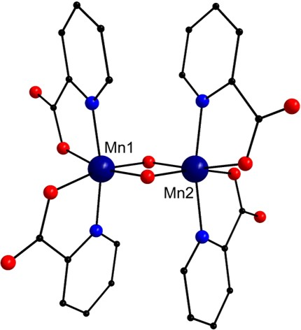

<html><head></head><body>

<h1>Modelling Broken Symmetry States</h1>

The determination of coupling constants generally relies on the use of broken symmetry states which essentially provide a means to represent 
antiferromagnetic states using a single determinant. Most computational chemistry codes are capable of modelling such states. 

The procedure to model broken symmetry states using the <a href="https://gaussian.com/">Gaussian</a> software is the following:

<blockquote>
<ol>
<li>Obtain the crystallographic coordinates or generate a model for the system to be investigated.</li>
<li>Model the ferromagnetic state and optimise the geometry.</li>
<li>Use the ferromagnetic state to generate a guess for the antiferromagnetic state.</li>
<li>Analyse the wavefunction to ensure that the wavefunction is stable. In case of instability, optimise the wavefunction until it is stable.</li>
<li>Optimise the geometry.</li>
</ol>
</blockquote>

Once the ferromagnetic and antiferromagnetic states are optimised, the wavefunction can be used to extract the spin density data. 
Mulliken charge analysis is carried out in <a href="https://gaussian.com/">Gaussian</a> by default. One can also perform the 
<a href="https://gaussian.com/population/">Hirshfeld</a> charge analysis and 
<a href="http://theory.cm.utexas.edu/henkelman/code/bader/"> Bader</a> charge analysis to determine the spin densities.
 We personally recommend the use of Bader spin densities.

(<b>Note:</b> Sometimes, the coupling constants are also determined using only the crystallographic coordinates without further optimisation. 
In such instances, only the wavefunction is optimised to model the ferromagnetic and antiferromagnetic states. The geometry is not optimised.)

To explain the procedure, we take the example of a dimeric Mn complex shown in Figure 1 below
[<a href="refs.htm#Libby" class="showTip Libby">Libby</a>]

 <b><i>Structure of the {MnIV2} complex. Colour scheme: Mn (dark blue), C (black), 
N (blue) and O (red). Hydrogen atoms have been removed for clarity.</i></b>
 
 

<h3>Ferromagnetic state</h3>

The coordinates for this complex were obtained from the CCDC database (CCDC reference: JAVYEK). 
[<a href="refs.htm#CCDC" class="showTip CCDC">CCDC</a>] 
The system was modelled using the PBE0 functional in conjunction with the SDDALL basis set having an effective core potential 
for the Mn atoms and 6-31g (d,p) basis set for C, O, N and H atoms. The system was divided into 3 fragments such that the Mn centres 
belong to two separate fragments and the ligand environment was included in a separate fragment. The input file for modelling the 
ferromagnetic state looks like the following:

<pre>
%nprocshared=16
%mem=50000MB
%chk=ferromagnetic.chk
# opt upbe1pbe/gen geom=connectivity pseudo=read

JAVYEK

0 7 -8 1 4 4 4 4
 Mn(Fragment=2)     9.68850000    3.22950000    5.30440000
 Mn(Fragment=3)     9.68850000    3.22950000    2.55860000
 O(Fragment=1)      8.84500000    4.07300000    3.93150000
....
....
....

C O N H 0
6-31g(d,p)
_****_
Mn 0
SDDALL
_****_

Mn 0
SDDALL
</pre>
 

The first two lines here specify the number of processors (16) and the memory (50 GB) dedicated for running the calculation. 
The third line specifies the name of the checkpoint file which stores the information about the wavefunction. 
The fourth line specifies the calculation specific terms which have the following meaning:

<table class="tg">
<thead>
  <tr>
    <th class="tg-0lax">opt</th>
    <th class="tg-0lax">Optimise the geometric coordinates.</th>
  </tr>
</thead>
<tbody>
  <tr>
    <td class="tg-0lax">upbe1pbe </td>
    <td class="tg-0lax">Use the PBE0 functional.</td>
  </tr>
  <tr>
    <td class="tg-0lax">gen</td>
    <td class="tg-0lax">Use the basis set described at the bottom of the input file.</td>
  </tr>
  <tr>
    <td class="tg-0lax">geom=connectivity </td>
    <td class="tg-0lax">Specify explicit atom bonding data via an additional input section.</td>
  </tr>
  <tr>
    <td class="tg-0lax">pseudo=read </td>
    <td class="tg-0lax">Use the effective core potential described at the bottom of the input file.</td>
  </tr>
</tbody>
</table>

The next line specifies the title. The line below that specifies the charge and multiplicity of the overall system 
and the various fragments. This is followed by the description of the atomic coordinates, the connectivity information 
and the basis set information.

The complete <a href="https://github.com/WatsonGroupTCD/J2suscep/blob/master/examples/gaussian_files/ferromagnetic.com">input</a> file is provided as part of the repository.

 

<h3>Antiferromagnetic state</h3>

The optimised ferromagnetic state is used generate a guess for the antiferromagnetic state. The <a href="https://github.com/WatsonGroupTCD/J2suscep/blob/master/examples/gaussian_files/antifer_guess.com">input</a> file for 
calculating a guess looks like the following:

<pre>
%nprocshared=16
%mem=50000MB 
%chk=JAVYEK_antiferro.chk
# upbe1pbe/gen guess=(only,fragment=3) geom=connectivity pop=minimal pseudo=read

JAVYEK

0 1 -8 1 4 4 4 -4
 Mn(Fragment=2)     0.00000900    1.35724000   -0.00000800
 Mn(Fragment=3)    -0.00000900   -1.35724000   -0.00000800
 O(Fragment=1)     -1.19325800    0.00000800   -0.00001300
……
……
……
C O N H 0
6-31g(d,p)
****
Mn 0
SDDALL
****

Mn 0
SDDALL
</pre>
 

The term ‘guess=(only,fragment=3)’ on the second line sets up the guess calculation with three fragments 
(which is the total number of fragments specified in this system). The term ‘pop=minimal’ controls the amount of data 
written in the log file and is not mandatory for the proper execution of this calculation.

Once the guess wavefunction is generated, it is analysed for any instability using the following <a href="https://github.com/WatsonGroupTCD/J2suscep/blob/master/examples/gaussian_files/antifer_stab.com">input</a> file:

<pre>
%nprocshared=16
%mem=50000MB
%chk=antiferro.chk
# stable=opt upbe1pbe/gen geom=allcheck pseudo=read guess=read

N C O H 0
6-31g(d,p)
_****_
Mn 0
SDDALL
_****_

Mn 0
SDDALL
</pre>
 

This calculation reads information from the checkpoint file antiferro.chk generated by the guess calculation. 
The term ‘stable=opt’ on the fourth line specifies that this calculation checks for the stability of the wavefunction and 
optimise it if any instability is found. The calculation updates the information in the checkpoint file antiferro.chk.

Once the wavefunction is optimised, it can be used to optimise the geometry using the following <a href="https://github.com/WatsonGroupTCD/J2suscep/blob/master/examples/gaussian_files/antifer_opt.com">input</a> file:

<pre>
%nprocshared=16
%mem=50000MB
%chk=antiferro.chk
# opt upbe1pbe/gen geom=allcheck pseudo=read guess=read

N C O H 0
6-31g(d,p)
****
Mn 0
SDDALL
****

Mn 0
SDDALL
</pre>
 

Again, the checkpoint file from the previous calculation is being read here for geometry optimisation.

<b>Note:</b> Whenever running these calculations, make sure that the spin densities on the metal centres is close to what is expected.
 Unexpected spin values may indicate problems in the wavefunction optimisation.

</body></html>
