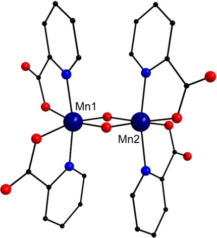

<html><head></head><body>

<h1>Worked Example</h1>

This section describes how one can obtain the necessary data required to prepare <a href="https://github.com/WatsonGroupTCD/J2suscep/wiki/Execution#format-of-file2"> File2</a> and execute J2suscep using the available computational chemistry code <a href="https://gaussian.com/">Gaussian</a>. The example here corresponds to the system described as example1 under 'Example Input Files' subsection of <A HREF="1e_example">EJ_Calc</A> and <A HREF="2e_example">Suscep</A> in this manual. The procedure can be summarised as follows:

<blockquote>
<ol>
<li>Model the ferromagnetic and broken symmetry states of the molecule under investigation.</li>
<li>Extract the spin density data and the energy of the system from the generated output files.</li>
<li>Use the spin density and energy data to prepare <a href="https://github.com/WatsonGroupTCD/J2suscep/wiki/Execution#format-of-file2"> File2</a> for J2suscep (EJ_calc).</li>
<li>Run J2suscep.</li>
</ol>
</blockquote>

<b>Note:</b> It is being assumed that the paths to the utilities and codes described in this example are already added to the PATH variable.

<h2>Modelling Ferromagnetic and Broken Symmetry States</h2>

The determination of coupling constants generally relies on the use of broken symmetry states which essentially provide a means to represent 
antiferromagnetic states using a single determinant. Most computational chemistry codes are capable of modelling such states. 

The procedure to model broken symmetry states using the <a href="https://gaussian.com/">Gaussian</a> software is the following:

<blockquote>
<ol>
<li>Obtain the crystallographic coordinates or generate a model for the system to be investigated.</li>
<li>Model the ferromagnetic state and optimise the geometry.</li>
<li>Use the ferromagnetic state to generate a guess for the antiferromagnetic state.</li>
<li>Analyse the wavefunction to ensure that the wavefunction is stable. In case of instability, optimise the wavefunction until it is stable.</li>
<li>Optimise the geometry.</li>
</ol>
</blockquote>

Once the ferromagnetic and antiferromagnetic states are optimised, the wavefunction can be used to extract the spin density data. 
Mulliken charge analysis is carried out in <a href="https://gaussian.com/">Gaussian</a> by default. One can also perform the 
<a href="https://gaussian.com/population/">Hirshfeld</a> charge analysis and 
<a href="http://theory.cm.utexas.edu/henkelman/code/bader/"> Bader</a> charge analysis to determine the spin densities.
 We personally recommend the use of Bader spin densities.

(<b>Note:</b> Sometimes, the coupling constants are also determined using only the crystallographic coordinates without further optimisation. 
In such instances, only the wavefunction is optimised to model the ferromagnetic and antiferromagnetic states. The geometry is not optimised.)

To explain the procedure, we take the example of a dimeric Mn complex shown in Figure 1 below
[<a href="refs.htm#Libby" class="showTip Libby">Libby</a>]

 <b><i>Structure of the {MnIV2} complex. Colour scheme: Mn (dark blue), C (black), 
N (blue) and O (red). Hydrogen atoms have been removed for clarity.</i></b>
 
 

<h3>Ferromagnetic state</h3>

The coordinates for this complex were obtained from the CCDC database (CCDC reference: JAVYEK). 
[<a href="refs.htm#CCDC" class="showTip CCDC">CCDC</a>] 
The system was modelled using the PBE0 functional in conjunction with the SDDALL basis set having an effective core potential 
for the Mn atoms and 6-31g (d,p) basis set for C, O, N and H atoms. The system was divided into 3 fragments such that the Mn centres 
belong to two separate fragments and the ligand environment was included in a separate fragment. The input file for modelling the 
ferromagnetic state looks like the following:

<pre>
%nprocshared=16
%mem=50000MB
%chk=ferromagnetic.chk
# opt upbe1pbe/gen geom=connectivity pseudo=read

JAVYEK

0 7 -8 1 4 4 4 4
 Mn(Fragment=2)     9.68850000    3.22950000    5.30440000
 Mn(Fragment=3)     9.68850000    3.22950000    2.55860000
 O(Fragment=1)      8.84500000    4.07300000    3.93150000
....
....
....

C O N H 0
6-31g(d,p)
_****_
Mn 0
SDDALL
_****_

Mn 0
SDDALL
</pre>
 

The first two lines here specify the number of processors (16) and the memory (50 GB) dedicated for running the calculation. 
The third line specifies the name of the checkpoint file which stores the information about the wavefunction. 
The fourth line specifies the calculation specific terms which have the following meaning:

<table class="tg">
<thead>
  <tr>
    <th class="tg-0lax">opt</th>
    <th class="tg-0lax">Optimise the geometric coordinates.</th>
  </tr>
</thead>
<tbody>
  <tr>
    <td class="tg-0lax">upbe1pbe </td>
    <td class="tg-0lax">Use the PBE0 functional.</td>
  </tr>
  <tr>
    <td class="tg-0lax">gen</td>
    <td class="tg-0lax">Use the basis set described at the bottom of the input file.</td>
  </tr>
  <tr>
    <td class="tg-0lax">geom=connectivity </td>
    <td class="tg-0lax">Specify explicit atom bonding data via an additional input section.</td>
  </tr>
  <tr>
    <td class="tg-0lax">pseudo=read </td>
    <td class="tg-0lax">Use the effective core potential described at the bottom of the input file.</td>
  </tr>
</tbody>
</table>

The next line specifies the title. The line below that specifies the charge and multiplicity of the overall system 
and the various fragments. This is followed by the description of the atomic coordinates, the connectivity information 
and the basis set information.

The complete <a href="https://github.com/WatsonGroupTCD/J2suscep/blob/master/examples/gaussian_files/ferromagnetic.com">input</a> file is provided as part of the repository.

 

To run the calculation using gaussian09, the following command can be used (assuming that the input file name is ferromagnetic.com):

<pre>g09 < ferromagnetic.com > ferromagnetic.out</pre>

This will generate a file called 'ferromagnetic.out' which will contain information in human readable format. Another file called 'ferromagnetic.chk' containing structure and wavefunction information in binary form will also be generated. 

<h3>Antiferromagnetic state</h3>

The optimised ferromagnetic state is used generate a guess for the antiferromagnetic state. The <a href="https://github.com/WatsonGroupTCD/J2suscep/blob/master/examples/gaussian_files/antifer_guess.com">input</a> file for 
calculating a guess looks like the following:

<pre>
%nprocshared=16
%mem=50000MB 
%chk=JAVYEK_antiferro.chk
# upbe1pbe/gen guess=(only,fragment=3) geom=connectivity pop=minimal pseudo=read

JAVYEK

0 1 -8 1 4 4 4 -4
 Mn(Fragment=2)     0.00000900    1.35724000   -0.00000800
 Mn(Fragment=3)    -0.00000900   -1.35724000   -0.00000800
 O(Fragment=1)     -1.19325800    0.00000800   -0.00001300
……
……
……
C O N H 0
6-31g(d,p)
****
Mn 0
SDDALL
****

Mn 0
SDDALL
</pre>
 

The term ‘guess=(only,fragment=3)’ on the second line sets up the guess calculation with three fragments 
(which is the total number of fragments specified in this system). The term ‘pop=minimal’ controls the amount of data 
written in the log file and is not mandatory for the proper execution of this calculation. The execution (assuming the input file name to be 'antifer_guess.com') is performed in the same manner as for the ferromagnetic state:

<pre>g09 < antifer_guess.com > antifer_guess.out</pre>

Once the guess wavefunction is generated, it is analysed for any instability using the following <a href="https://github.com/WatsonGroupTCD/J2suscep/blob/master/examples/gaussian_files/antifer_stab.com">input</a> file:

<pre>
%nprocshared=16
%mem=50000MB
%chk=antiferro.chk
# stable=opt upbe1pbe/gen geom=allcheck pseudo=read guess=read

N C O H 0
6-31g(d,p)
_****_
Mn 0
SDDALL
_****_

Mn 0
SDDALL
</pre>
 

This calculation reads information from the checkpoint file antiferro.chk generated by the guess calculation. 
The term ‘stable=opt’ on the fourth line specifies that this calculation checks for the stability of the wavefunction and 
optimise it if any instability is found. The calculation updates the information in the checkpoint file antiferro.chk.

The execution (assuming the input file name to be 'antifer_stab.com') is performed as follows:

<pre>g09 < antifer_stab.com > antifer_stab.out</pre>

Once the wavefunction is optimised, it can be used to optimise the geometry using the following <a href="https://github.com/WatsonGroupTCD/J2suscep/blob/master/examples/gaussian_files/antifer_opt.com">input</a> file:

<pre>
%nprocshared=16
%mem=50000MB
%chk=antiferro.chk
# opt upbe1pbe/gen geom=allcheck pseudo=read guess=read

N C O H 0
6-31g(d,p)
****
Mn 0
SDDALL
****

Mn 0
SDDALL
</pre>
 

Again, the checkpoint file from the previous calculation is being read here for geometry optimisation.

The execution (assuming the input file name to be 'antifer_opt.com') is performed as follows:

<pre>g09 < antifer_opt.com > antifer_opt.out</pre>

<b>Note:</b> Whenever running these calculations, make sure that the spin densities on the metal centres is close to what is expected. This can be done by looking up the Mullken spin densities which are printed by default in gaussian.  Unexpected spin values may indicate problems in the wavefunction optimisation.

<h2>Extracting spin density and energy data</h2>

Once the calculations are completed, one can start extracting the data from the output files and arrange the data in the format required for <a href="https://github.com/WatsonGroupTCD/J2suscep/wiki/Execution#format-of-file2"> File2</a>. <b> Make sure that the spin density and energy data being extracted correspond to that after the system has been optimised.</b>

The energy information can be easily extracted from the .out/.log files. For spin denisties, if one is interested in only the Mulliken densities, they may be copied from the .out/.log files and copied to File2 in the proper format. For <a href="https://gaussian.com/population/">Hirshfeld</a> charge analysis, one needs to include 'pop=Hirshfeld' keyword in the optimisation runs for the ferromagnetic and the broken symmetry states.

Gaussian09 does not perform Bader analysis but it can be easily done using a code provided by the <a href="http://theory.cm.utexas.edu/henkelman/code/bader/"> Henkelman group</a>. To perform the Bader analysis, one needs to make use of the .chk files to create the formatted checkpoint (.fchk) files. For the above example, once the calculations for ferromagnetic and broken symmetry states are complete, one will have two .chk files - ferromagnetic.chk and antiferro.chk. To create the .fchk files, the <a href="https://gaussian.com/formchk/">formchk</a> utility can be used as:

<pre>
formchk ferromagnetic.chk
formchk antiferro.chk
</pre>

Once the formatted checkpoint files are obtained, they are used to generate the 'cube' files using the <a href="https://gaussian.com/cubegen/">cubegen</a> utility in gaussian. For both the .fchk files, two cube files - containing spin density and total electron density - will be generated as:

<pre>
cubegen 2 spin=scf ferromagnetic.fchk ferromagnetic_spin.cube -4 
cubegen 2 density=scf ferromagnetic.fchk ferromagnetic_tot_dens_fine.cube -4
cubegen 2 spin=scf antiferro.fchk antiferro_spin.cube -4
cubegen 2 density=scf antiferro.fchk antiferro_tot_dens_fine.cube -4
</pre>

The 'ferromagnetic_spin.cube' and 'antiferro_spin.cube' files contain information about the spin densities while the files 'ferromagnetic_tot_dens_fine.cube' and 'antiferro_tot_dens_fine.cube' contain information about the total electron densities. 

These '.cube' files are then used to perform Bader analysis as follow:

<pre>
bader ferromagnetic_spin_fine.cube -ref ferromagnetic_tot_dens_fine.cube
bader antiferro_spin_fine.cube -ref antiferro_tot_dens_fine.cube
</pre>

This will generate a file called 'ACF.dat' containing the Bader spin densities for the different states. It must be kept in mind that the output file is always named ACF.dat with the bader code. Hence, it is necessary that the execution of the bader code for the various spin states in performed in a way to avoid overwriting of the output files.

Once the energy and spin density information is obtained, one can create <a href="https://github.com/WatsonGroupTCD/J2suscep/wiki/Execution#format-of-file2"> File2</a> which should resemble the input file <a href="https://github.com/WatsonGroupTCD/J2suscep/blob/master/examples/ej_calc_form/example1/spin"> spin</a> provided as part of the repository. This, along with <a href="https://github.com/WatsonGroupTCD/J2suscep/wiki/Execution#format-of-file1"> File1</a>, <a href="https://github.com/WatsonGroupTCD/J2suscep/wiki/Execution#format-of-file3"> File3</a> and <a href="https://github.com/WatsonGroupTCD/J2suscep/wiki/Execution#format-of-file4"> File4</a>, can be then used to execute J2suscep. The information required for <a href="https://github.com/WatsonGroupTCD/J2suscep/wiki/Execution#format-of-file1"> File1</a> and <a href="https://github.com/WatsonGroupTCD/J2suscep/wiki/Execution#format-of-file3"> File3</a> primarily depends upon the system under consideration and require no calculations as such. For this example, the details of these files are provided under the 'Example Input Files' subsection of <A HREF="1e_example">EJ_Calc</A> and <A HREF="2e_example">Suscep</A>. The information for <a href="https://github.com/WatsonGroupTCD/J2suscep/wiki/Execution#format-of-file4"> File4</a> is obtained after executing ej_calc and the details are provided in the <A HREF="1e_example">Example Input Files</A> section of Suscep.

</body></html>
